<h2 align=center>
	 
	Marzipan
</h2>

<h6 align="center">
    A delicious & rich theme to make your computer sugar sweet.
</h6>

> [!NOTE] 
> *Marzipan* is a very new theme maintained by one person with commitment issues.
> Currently very few ports and palettes are available.

### 🧠 Design

*Marzipan* is designed with a few key ideas in mind to guide what it needs, and more crucially, what it doesn't need.

- **No theme is for everybody**: Theme's are a choice; not everybody will use it, so why try to make it look *decent* to everybody? *Marzipan* is made to look *great* to a few, namely myself.
- **Contrast is beautiful**: Bright pastel colours look even better in front of a deep rich black. My original idea for *Marzipan* was just a fork of [Catppuccin Mocha](https://github.com/catppuccin/catppuccin) with a darker background.
- **Fewer colours makes each colour look better**: *Marzipan* defines a few shades of a primary colour (pink), a secondary colour (yellow), and a tertiary colour (blue). Pretty much all ports just use those three colours, often just the two.

### 🎨 Palette

	
🏁 Monochrome

	<table>
		<tr>
			<th></th>
			<th>Label</th>
			<th>Hex</th>
			<th>RGB</th>
			<th>HSV</th>
		</tr>
		<tr>
			<td></td>
			<td>Dark 1</td>
			<td><code>#070812</code></td>
			<td>7, 8, 18</td>
			<td>235, 61, 7</td>
		</tr>
		<tr>
			<td></td>
			<td>Dark 2</td>
			<td><code>#101022</code></td>
			<td>16, 16, 34</td>
			<td>240, 53, 13</td>
		</tr>
		<tr>
			<td></td>
			<td>Dark 3</td>
			<td><code>#211E39</code></td>
			<td>33, 30, 57</td>
			<td>247, 47, 22</td>
		</tr>
		<tr>
			<td></td>
			<td>Dark 4</td>
			<td><code>#3D3656</code></td>
			<td>61, 54, 86</td>
			<td>253, 37, 34</td>
		</tr>
		<tr>
			<td>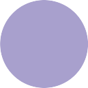</td>
			<td>Light 4</td>
			<td><code>#A8A0CD</code></td>
			<td>168, 160, 205</td>
			<td>251, 22, 80</td>
		</tr>
		<tr>
			<td>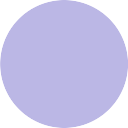</td>
			<td>Light 3</td>
			<td><code>#BBB7E5</code></td>
			<td>187, 183, 229</td>
			<td>245, 20, 90</td>
		</tr>
		<tr>
			<td>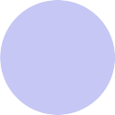</td>
			<td>Light 2</td>
			<td><code>#C6C7F4</code></td>
			<td>198, 199, 244</td>
			<td>239, 19, 96</td>
		</tr>
		<tr>
			<td>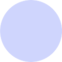</td>
			<td>Light 1</td>
			<td><code>#CFD5FD</code></td>
			<td>207, 213, 253</td>
			<td>232, 18, 99</td>
		</tr>
	</table>

	
🍭 Colours

	<table>
		<tr>
			<th></th>
			<th>Label</th>
			<th>Hex</th>
			<th>RGB</th>
			<th>HSV</th>
		</tr>
		<tr>
			<td>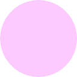</td>
			<td>Primary Light</td>
			<td><code>#FCCAFF</code></td>
			<td>252, 202, 255</td>
			<td>297, 21, 100</td>
		</tr>
		<tr>
			<td></td>
			<td>Primary</td>
			<td><code>#FFBDF8</code></td>
			<td>255, 189, 248</td>
			<td>306, 26, 100</td>
		</tr>
		<tr>
			<td>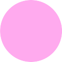</td>
			<td>Primary Dark</td>
			<td><code>#FFAAEE</code></td>
			<td>255, 170, 238</td>
			<td>312, 33, 100</td>
		</tr>
		<tr>
			<td>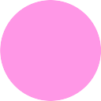</td>
			<td>Primary Darker</td>
			<td><code>#FF97E6</code></td>
			<td>255, 151, 230</td>
			<td>314, 41, 100</td>
		</tr>
		<tr>
			<td>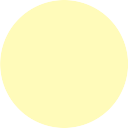</td>
			<td>Secondary Light</td>
			<td><code>#FFFBBA</code></td>
			<td>255, 251, 186</td>
			<td>57, 27, 100</td>
		</tr>
		<tr>
			<td>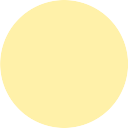</td>
			<td>Secondary</td>
			<td><code>#FFF1A9</code></td>
			<td>255, 241, 169</td>
			<td>50, 34, 100</td>
		</tr>
		<tr>
			<td>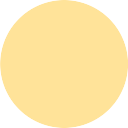</td>
			<td>Secondary Dark</td>
			<td><code>#FFE399</code></td>
			<td>255, 227, 153</td>
			<td>44, 40, 100</td>
		</tr>
		<tr>
			<td></td>
			<td>Secondary Darker</td>
			<td><code>#FFD388</code></td>
			<td>255, 211, 136</td>
			<td>38, 47, 100</td>
		</tr>
		<tr>
			<td>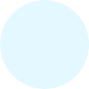</td>
			<td>Tertiary Light</td>
			<td><code>#E3F8FF</code></td>
			<td>227, 248, 255</td>
			<td>195, 11, 100</td>
		</tr>
		<tr>
			<td>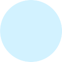</td>
			<td>Tertiary</td>
			<td><code>#D2F2FF</code></td>
			<td>210, 242, 255</td>
			<td>197, 18, 100</td>
		</tr>
		<tr>
			<td>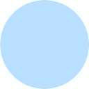</td>
			<td>Tertiary Dark</td>
			<td><code>#B8DFFF</code></td>
			<td>184, 223, 255</td>
			<td>207, 28, 100</td>
		</tr>
		<tr>
			<td>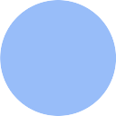</td>
			<td>Tertiary Darker</td>
			<td><code>#98BDF9</code></td>
			<td>152, 189, 249</td>
			<td>217, 39, 98</td>
		</tr>
	</table>

	
🌈 Extras

	<table>
		<tr>
			<th></th>
			<th>Label</th>
			<th>Hex</th>
			<th>RGB</th>
			<th>HSV</th>
		</tr>
		<tr>
			<td>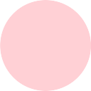</td>
			<td>Red Light</td>
			<td><code>#FFD0D5</code></td>
			<td>255, 208, 213</td>
			<td>354, 18, 100</td>
		</tr>
		<tr>
			<td>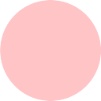</td>
			<td>Red</td>
			<td><code>#FFC4C6</code></td>
			<td>255, 196, 198</td>
			<td>358, 23, 100</td>
		</tr>
		<tr>
			<td>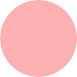</td>
			<td>Red Dark</td>
			<td><code>#FDB1B2</code></td>
			<td>253, 177, 178</td>
			<td>359, 30, 99</td>
		</tr>
		<tr>
			<td>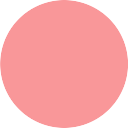</td>
			<td>Red Darker</td>
			<td><code>#F99799</code></td>
			<td>249, 151, 153</td>
			<td>359, 39, 98</td>
		</tr>
		<tr>
			<td>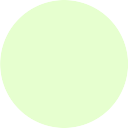</td>
			<td>Green Light</td>
			<td><code>#E6FFCF</code></td>
			<td>230, 255, 207</td>
			<td>91, 19, 100</td>
		</tr>
		<tr>
			<td>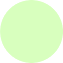</td>
			<td>Green</td>
			<td><code>#D8FFBE</code></td>
			<td>216, 255, 190</td>
			<td>96, 15, 100</td>
		</tr>
		<tr>
			<td>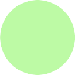</td>
			<td>Green Dark</td>
			<td><code>#BDFAA5</code></td>
			<td>189, 250, 165</td>
			<td>103, 34, 98</td>
		</tr>
		<tr>
			<td>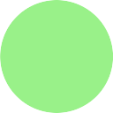</td>
			<td>Green Darker</td>
			<td><code>#99F189</code></td>
			<td>153, 241, 137</td>
			<td>111, 43, 95</td>
		</tr>
		<tr>
			<td>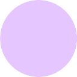</td>
			<td>Purple Light</td>
			<td><code>#E6C6FF</code></td>
			<td>230, 198, 255</td>
			<td>274, 22, 100</td>
		</tr>
		<tr>
			<td>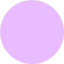</td>
			<td>Purple</td>
			<td><code>#E8BCFF</code></td>
			<td>232, 188, 255</td>
			<td>279, 26, 100</td>
		</tr>
		<tr>
			<td>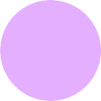</td>
			<td>Purple Dark</td>
			<td><code>#E5AFFF</code></td>
			<td>229, 175, 255</td>
			<td>281, 21, 100</td>
		</tr>
		<tr>
			<td>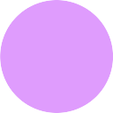</td>
			<td>Purple Darker</td>
			<td><code>#DF9CFD</code></td>
			<td>223, 156, 253</td>
			<td>281, 38, 99</td>
		</tr>
	</table>

### ℹ️Examples

SDDM

### 🖥️ Ports

- **[SDDM](https://github.com/marzipan-theme/sddm)**
- **Grub [TODO]**
- **Wezterm [TODO]**
- **Neovim [TODO]**
- **TTY [TODO]**

### 📜 Contributing

If you would like to contribute your own port or palette, or make suggestions about the design, contact me @kaitlynethylia on Discord. I haven't written any style guide or contribuiiting guidelines yet because it would be a waste of time unless somebody were interested.
